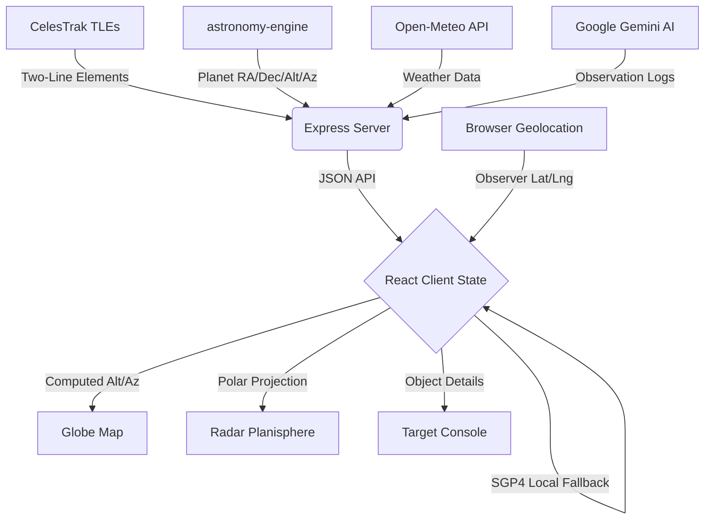

# 🌌 ZENITH — The Celestial Eye

> **Real-time Satellite & Celestial Object Tracking Observatory**
> A full-stack astronomical dashboard combining SGP4 orbital propagation, polar radar visualization, interactive globe tracking, and AI-powered observation logs — built with React, TypeScript, and Node.js.

---

<p align="center">
  
  
  
  
  
  
  
</p>

---

## 📋 Table of Contents

- [Features](#-features)
- [Dashboard Architecture](#-dashboard-architecture)
- [Data Pipeline](#-data-pipeline)
- [Tech Stack & Dependencies](#-tech-stack--dependencies)
- [API Keys Required](#-api-keys-required)
- [Setup & Installation](#-setup--installation)
- [Project Structure](#-project-structure)
- [API Endpoints](#-api-endpoints)
- [How It Works](#-how-it-works)
- [Design Standards](#-design-standards)

---

## ✨ Features

### Core Tracking
- **🛰️ Real-time ISS Tracking** — Live latitude/longitude/altitude via SGP4 orbital propagation using actual CelesTrak TLE data
- **📡 Multi-Satellite Monitoring** — Track Hubble, Tiangong, Aryabhata, Chandrayaan, Starlink, and more from a curated satellite catalog
- **🌍 Interactive Globe Map** — Leaflet-based dual-mode map (Dark tactical / Satellite imagery) with smooth 60fps camera tracking via `requestAnimationFrame`
- **🔭 Polar Planisphere Radar** — Canvas-rendered planisphere showing objects projected from your observer position with a rotating radar sweep

### Celestial Objects
- **🪐 Planet Positions** — Real-time Right Ascension, Declination, Alt/Az for Mercury, Venus, Mars, Jupiter, Saturn, Uranus, Neptune using `astronomy-engine`
- **🌙 Moon & Sun Tracking** — Phase calculations, illumination percentage, and horizon coordinates
- **⭐ Star Catalog** — 50+ brightest stars (Sirius, Canopus, Vega, etc.) with proper RA/Dec coordinates
- **✨ Constellation Overlay** — Toggle IAU constellation boundaries on the radar (Orion, Ursa Major, Scorpius, etc.)

### Observatory Tools
- **🌡️ Atmospheric Suitability** — Seeing conditions (arcsec), scintillation index, Bortle scale, temperature & humidity from live weather
- **🧪 Spectroscopic Analyzer** — Chemical composition display with Fraunhofer absorption lines for each target
- **⏱️ Temporal Warp** — Time multiplier (1x → 300x) for fast-forwarding orbital trajectories
- **📝 AI Observation Logs** — Gemini-powered intelligent observation notes generated per object
- **🔊 Audio Synthesizer** — Web Audio API synthesizer for target lock pings, sweep sounds, and alerts
- **🌒 Night Vision Mode** — Red-shift CSS filter to protect dark adaptation

### UX
- **📍 Auto Geolocation** — Automatically acquires your browser location on load to set observer coordinates
- **🔒 Camera Lock / Free Cam** — Toggle between auto-tracking a satellite and free manual map navigation
- **🎯 Cross-Panel Selection Sync** — Click a satellite on the radar, globe, or panel — all views sync instantly
- **🏔️ Observatory Presets** — Quick-select from Mauna Kea, Paranal, Arecibo, and other world observatories

---

## 🛰️ Dashboard Architecture

| Panel | Location | Description |
| :--- | :---: | :--- |
| **📡 Polar Planisphere** | Center | Rotating circular radar — zenith at center, horizon at edge. 10° azimuth/elevation grid, neon sweep, constellation overlays. |
| **🗺️ Geocentric Globe** | Left | Leaflet map with live ground tracks, orbital path polylines, ISS/satellite markers, observer station pin. |
| **🔭 Target Console** | Right | Detailed object card — spectrum analyzer, transit schedule, orbital parameters, physical specifications. |
| **🌡️ Atmospheric Panel** | Right | Seeing/scintillation calculations, Bortle scale, weather-derived sky quality. |
| **📝 Intel Logs** | Left | AI-generated observation notes, saved log history, fun facts per object. |
| **⏱️ Time Controls** | Bottom | Warp speed slider, sidereal clock, UTC/local time display. |
| **🔍 Search & Config** | Top | Observatory presets, manual lat/lng entry, city search, live location. |

---

## 📡 Data Pipeline



> **Dual-mode telemetry:** The app polls the Express backend every ~5 seconds for fresh data. If the server is unreachable, a client-side SGP4 fallback (`satellite.js`) computes positions locally using embedded TLE data — ensuring the dashboard never goes dark.

---

## 🔧 Tech Stack & Dependencies

### Frontend

| Package | Version | Purpose |
| :--- | :---: | :--- |
| `react` | ^19.0.1 | UI framework |
| `react-dom` | ^19.0.1 | DOM rendering |
| `typescript` | ~5.8.2 | Type safety |
| `vite` | ^6.2.3 | Dev server & bundler |
| `tailwindcss` | ^4.1.14 | Utility-first CSS |
| `leaflet` | ^1.9.4 | Interactive map |
| `react-leaflet` | ^5.0.0 | React bindings for Leaflet |
| `lucide-react` | ^0.546.0 | Icon library |
| `motion` | ^12.23.24 | Animations |
| `satellite.js` | ^4.1.4 | SGP4/SDP4 orbital propagation |

### Backend

| Package | Version | Purpose |
| :--- | :---: | :--- |
| `express` | ^4.21.2 | HTTP server & API routes |
| `@google/genai` | ^2.4.0 | Gemini AI for observation logs |
| `astronomy-engine` | ^2.1.19 | High-precision planetary calculations |
| `dotenv` | ^17.2.3 | Environment variable loading |
| `tsx` | ^4.21.0 | TypeScript execution (dev) |
| `esbuild` | ^0.25.0 | Server bundling (production) |

---

## 🔑 API Keys Required

The application uses the following external services. Create a `.env` file in the project root:

```env
# Required for AI-powered observation logs
GEMINI_API_KEY=your_google_gemini_api_key

# Optional: separate key for Zenith-specific AI features (falls back to GEMINI_API_KEY)
ZENITH_API_KEY=your_zenith_api_key

# Server port (default: 3000)
PORT=3000
```

### How to get the keys

| Key | Source | Required? | What it powers |
| :--- | :--- | :---: | :--- |
| `GEMINI_API_KEY` | [Google AI Studio](https://aistudio.google.com/apikey) | **Recommended** | AI observation log generation via `/api/intel` and `/api/zenith/observe` |
| `ZENITH_API_KEY` | Same as above (or a separate key) | Optional | Falls back to `GEMINI_API_KEY` if not set |

> **Note:** The app works fully without any API keys — satellite tracking, orbital calculations, planet positions, weather data, and the full radar/globe UI all function without Gemini. Only the AI-generated observation notes require a key.

### Free APIs (no key needed)

| Service | URL | What it provides |
| :--- | :--- | :--- |
| **Open-Meteo** | `api.open-meteo.com` | Temperature, humidity, cloud cover, weather codes |
| **CelesTrak** | `celestrak.org` | TLE orbital elements for satellites |
| **ArcGIS / CartoDB** | Tile servers | Map imagery tiles |

---

## 🛠️ Setup & Installation

### Prerequisites

- **Node.js** `v18` or higher
- **npm** (comes with Node.js)
- A modern browser with WebGL support (Chrome, Firefox, Edge, Safari)

### Quick Start

```bash
# 1. Clone the repository
git clone https://github.com/reshmanth-sai/Project-Zenith.git
cd Project-Zenith

# 2. Install dependencies
npm install

# 3. Create environment file
cp .env.example .env
# Edit .env and add your GEMINI_API_KEY (optional but recommended)

# 4. Start development server
npm run dev
```

The app will be available at **[http://localhost:3000](http://localhost:3000)**

### Available Scripts

| Command | Description |
| :--- | :--- |
| `npm run dev` | Start development server (Express + Vite HMR) |
| `npm run build` | Production build (Vite client + esbuild server) |
| `npm run start` | Start production server from `/dist` |
| `npm run preview` | Alias for `npm run start` |
| `npm run lint` | TypeScript type checking (`tsc --noEmit`) |
| `npm run clean` | Remove build artifacts |

### Production Deployment

```bash
# Build optimized bundles
npm run build

# Start production server
npm run start
# or
node dist/server.cjs
```

The production build outputs:
- `dist/index.html` — Entry HTML
- `dist/assets/index-*.css` — Compiled CSS (~84 KB)
- `dist/assets/index-*.js` — Compiled JS (~738 KB, ~234 KB gzipped)
- `dist/server.cjs` — Bundled Express server (~32 KB)

---

## 📂 Project Structure

```
Project-Zenith/
├── server.ts                          # Express backend (API routes, Gemini AI, astronomy-engine)
├── package.json                       # Dependencies & scripts
├── vite.config.ts                     # Vite bundler configuration
├── tsconfig.json                      # TypeScript configuration
├── .env                               # Environment variables (API keys)
│
├── src/
│   ├── App.tsx                        # Main application — state management, telemetry loop
│   ├── main.tsx                       # React entry point
│   ├── index.css                      # Global styles, animations, night vision
│   ├── types.ts                       # TypeScript interfaces (CelestialObject, Observer, etc.)
│   │
│   ├── components/
│   │   ├── Globe.tsx                  # Leaflet map — satellite markers, orbital paths, camera tracking
│   │   ├── SkyView.tsx                # Canvas polar planisphere — radar sweep, star/planet plotting
│   │   ├── ObjectPanel.tsx            # Sidebar — satellite/planet list, search, filter tabs
│   │   ├── ObjectCard.tsx             # Detail card — spectrum analyzer, transit times, specs
│   │   ├── SearchBar.tsx              # Observatory presets, coordinate input, city search
│   │   ├── AtmosphericSuitability.tsx # Seeing, scintillation, Bortle scale display
│   │   ├── FunFactPanel.tsx           # AI observation logs, saved entries
│   │   └── ObservationControlHub.tsx  # Quest challenges, live events panel
│   │
│   ├── context/
│   │   └── ObserverContext.tsx         # Global observer location state (auto-geolocation)
│   │
│   └── lib/
│       ├── satellite.ts               # SGP4 propagation, ISS TLE, path generation
│       ├── astronomy.ts               # Coordinate transforms (RA/Dec → Alt/Az)
│       ├── starCatalog.ts             # 50+ star database with RA/Dec/magnitude
│       └── synth.ts                   # Web Audio API sound synthesizer
│
└── dist/                              # Production build output
```

---

## 🌐 API Endpoints

The Express server exposes the following REST endpoints:

| Method | Endpoint | Description | Query Params |
| :---: | :--- | :--- | :--- |
| `GET` | `/api/iss` | ISS position & look angles | `lat`, `lng`, `elevation`, `timestamp` |
| `GET` | `/api/satellites` | All tracked satellite positions | `lat`, `lng`, `elevation`, `timestamp` |
| `GET` | `/api/planets` | Planet/Moon/Sun positions | `lat`, `lng`, `elevation`, `timestamp` |
| `GET` | `/api/weather` | Atmospheric conditions | `lat`, `lng` |
| `GET` | `/api/intel` | AI-generated observation note | `name`, `type`, `lat`, `lng` |
| `POST` | `/api/zenith/observe` | Detailed AI observation log | JSON body with target details |

### Example Request

```bash
# Get ISS position from Mauna Kea
curl "http://localhost:3000/api/iss?lat=19.82&lng=-155.47&elevation=4207"

# Get all planet positions from Chennai
curl "http://localhost:3000/api/planets?lat=13.08&lng=80.27&elevation=6"

# Get weather for observer location
curl "http://localhost:3000/api/weather?lat=13.08&lng=80.27"
```

---

## ⚙️ How It Works

### Satellite Tracking (SGP4)
Satellite positions are computed using the **SGP4/SDP4** orbital propagation model via `satellite.js`. The server stores TLE (Two-Line Element) data from CelesTrak for each satellite and propagates the orbital state to any given timestamp. The result is converted from ECI → ECEF → geodetic coordinates (lat/lng/altitude) and observer-relative look angles (azimuth/elevation/range).

### Planet Positions (astronomy-engine)
Solar system body positions are calculated using the `astronomy-engine` library, which provides high-precision ephemeris computations. Given an observer's geographic coordinates and a timestamp, it computes:
- **Equatorial coordinates**: Right Ascension (RA) and Declination (Dec)
- **Horizontal coordinates**: Altitude (elevation above horizon) and Azimuth (compass bearing)

### Polar Radar Projection
The planisphere uses a **stereographic polar projection** where:
- **Center** = Zenith (90° elevation directly overhead)
- **Edge** = Horizon (0° elevation)
- **Angle** = Azimuth (0° = North, clockwise)

Objects are plotted using: `r = (1 - altitude/90) × radius` and `θ = azimuth°`

### Camera Tracking System
The globe map uses a `requestAnimationFrame`-based smooth interpolation loop:
1. Telemetry updates set a **target coordinate** ref
2. Each animation frame applies **exponential damping** (`α = 0.15` normal, `α = 0.05` during warp)
3. The camera smoothly glides to the target without jitter
4. A **programmatic fly guard** prevents Leaflet's internal events from breaking camera lock during animated transitions

### Client-Side Fallback
When the server is unreachable, the client activates `executeLocalBackupTelemetry()`:
- ISS: Full SGP4 propagation using embedded TLE data
- Other satellites: Simplified Keplerian orbital model using stored inclination, period, and altitude
- Planets: Uses locally computed Alt/Az from the `astronomy.ts` library

---

## 🎨 Design Standards

- **Typography**: `Inter` (UI text), `Space Grotesk` (display headings), `JetBrains Mono` (telemetry readouts)
- **Color Palette**: Deep slate-indigo dark mode with accent glows — no generic colors
- **Glassmorphism**: `backdrop-blur-md` panels with subtle border opacity for depth
- **Night Vision**: Full red-shift CSS filter mode (`hue-rotate(-50deg) + sepia`) for dark adaptation
- **Animations**: CSS transitions, `requestAnimationFrame` loops, canvas radar sweep at 60fps
- **Responsive**: Flexbox/Grid layout adapting from mobile to ultra-wide displays

---

<p align="center">
  <sub>🔭 Project Zenith — Built for the stars.</sub>
</p>
