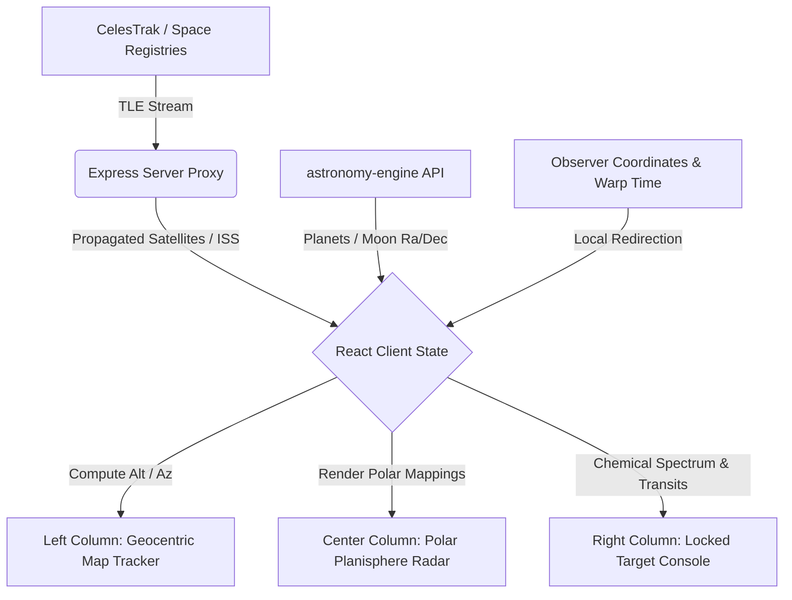

# 🌌 ZENITH | The Celestial Eye `v1.4`

> **Advanced Geocentric Satellite & Planetary Radar Tracking Interface**
> An astronomical observatory dashboard merging high-precision orbital mechanics with high-fidelity, polar-radar style telemetry visualizations.

---

<p align="center">
  
  
  
  
  
  
  
</p>

---

## 🛰️ Dashboard Architecture

ZENITH splits the sky into a cohesive, widescreen geocentric grid. Below is the blueprint of the instrumentation layout:

| Panel | Type | Description |
| :--- | :---: | :--- |
| **📡 Polar Planisphere** | Center Column | A unified rotating circular radar projection where the center maps directly to the zenith (90° overhead) and the extreme outer edge maps to the local horizon (0° elevation). Features 10° azimuth markers and a continuous neon green sweep. |
| **🗺️ Geocentric Tracker & 3D Globe** | Left Column | A dual-mode visualization deck. Toggle between a high-precision **3D Canvas Globe** (with interactive rotation, click-to-calibrate coordinates, and 3D satellite orbits) and a **2D Leaflet Photographic Map** (rendering live ground track footprint lines and coordinate captures). |
| **🌡️ Atmospheric Suitability** | Right Column | Real-time observational forecasting of sky transparency score (Optimal/Moderate/Poor), angular seeing (arcseconds), scintillation index (twinkle freq variance), and Bortle light pollution levels. |
| **🧪 Spectroscopic Analyzer** | Right Column | Glow-bar chemical signature widget mapping Fraunhofer absorption lines and concentrations (e.g. Venus showing `96.5% CO₂`, Moon showing `21% Silicon`). |
| **☀ Temporal Warp Harness** | Bottom Bar | Sidereal time-travel simulator (warp speeds from 1x to 300x) allowing historical analysis and transit predictions. |
| **🔊 Acoustic Synthesizer** | Header | Monosynth playing Web Audio API sound FX for target locks and horizon crossing alerts. |
| **📝 Spectral Intel Logs** | Left Column | Telemetry logs and fun facts with an integrated AI model generator and a fallback database for deep space research. |

---

## 📡 Operational Data Pipeline

ZENITH bypasses unstable external client requests by proxying through a local Express node, propagating satellite orbits dynamically:



> [!NOTE]
> **Orbital Propagation Details:** Artificial satellite trajectories are computed locally via SGP4/SDP4 models (via `satellite.js`) based on CelesTrak's Three-Line/Two-Line Elements (TLEs). Planetary horizontal coordinates (Alt/Az), Right Ascension, and Declination are mapped using high-precision calculations relative to your observer coordinates.

---

## 🛠️ Project Setup & Installation

Follow these steps to spin up the system locally:

### Prerequisites
* **Node.js**: `v18` or higher
* **Package Manager**: `npm`

### Installation Commands

1. **Clone & Install Dependencies**
   ```bash
   git clone https://github.com/YOUR_USERNAME/Project-Zenith.git
   cd Project-Zenith
   npm install
   ```

2. **Configure Environment Variables**
   Create a `.env` file at the root. You can copy the defaults from `.env.example`:
   ```env
   PORT=3000
   NODE_ENV=development
   GEMINI_API_KEY=your-gemini-key
   ZENITH_API_KEY=your-zenith-key
   ```

3. **Launch local instance**
   ```bash
   npm run dev
   ```
   *Starts the Express server backend and Vite dev client simultaneously on [http://localhost:3000](http://localhost:3000).*

4. **Production Build**
   Vite compiles client assets, while esbuild bundles the TypeScript backend into a single CommonJS server under `/dist`:
   ```bash
   npm run build
   npm run start
   ```

---

## 🎨 UI/UX Design Standards

The design mirrors the aesthetic of a modern, professional space telescope observatory:

* **Typography Hierarchy**: Structured geometric sans-serif **Inter** for titles and labels, paired with high-density monospace **JetBrains Mono** for numerical degrees, lat/lng readouts, and raw telemetry bytes.
* **Deep Space Color Palette**: A sleek slate-indigo layout (`bg-slate-950/60`, `border-slate-900`, `backdrop-blur-md`) layered with monochromatic red-shift filters (**Night Vision Mode**) to simulate optical instrument field conditions.
* **Leaflet Viewport Stabilization**: Integrates `ResizeObserver` size invalidators on the map container. The map automatically recalculates tile request bounds when container dimensions shift, preventing empty unrendered grey regions.
* **Zero Dummy Telemetry**: No generic random number generators or fake sci-fi loading text. All details displayed represent real, calculated physical values based on active astronomical orbital science.

---

<p align="center">
  <sub>Project Zenith — Engineered by Google DeepMind Agentic Coding.</sub>
</p>
